# Research Topic : Implementation of Different Pathfindings
#### Alexandre Beeckmans	-	2GD10	-	2023/2024

## Introduction
The goal of this research work is to discover different existing pathfindig algorithms.
We already covered A* pathfinding during classes but there are many more. Each pathfinding has strengths and weaknesses depending of the context it is used.
My purpose in this work is to cover a few of them, and to explain in which context it can be used.
Since most of the pathfinding algorithms are based on A*,
I will start this document by a brief explanation of what is the **A\* pathfinding**, so anyone could be able to understand the following explanations.
I will continue by explaining what is **Theta\* pathfinding**, an optimization to A* pathfindig.
The last original shortest-path finder I will cover is the **Jump Point Search**.
I will continue with some explanations and probability calculations about the **Random Walks**.
Finally, I will have a small talk about the **Post-Smoothing**, a way to optimize a path after having calculated it.

## A* :

The A* pathfinding is an algorithm that is supposed to find the shortest path in a weighted environement.
A* algorithm will return a path for which the sum of the weight of all the connections is the lowest.

A* pathfindig works with a system of open and closed list.
- **Open List :** contains all the nodes that have to be checked.
- **Closed List :** contains all the node already checked.

### Implementation :
1. Add the Starting Node to the open list.

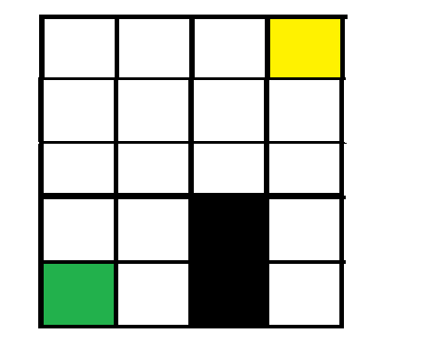

2. Calculate the cost of the connection to each neighbouring nodes.
3. Add all the neighbouring nodes to the open list.
4. Move the current node from the open list to the closed list.
5. Set the node with the lowest cost as the current node.
6. Repeat steps 2 to 6 until the destination node is reached.
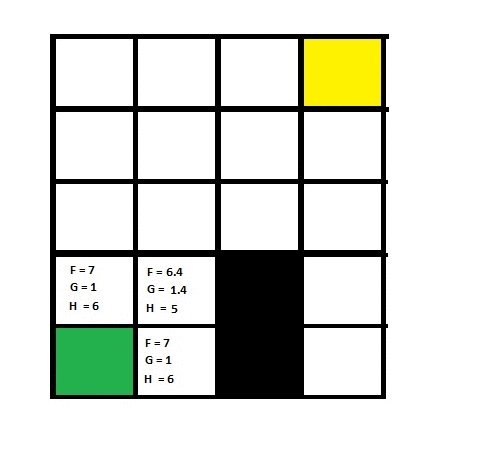

### References :
1 : Howest Digital Arts & Entertainment, Gameplay Programming course : Week 5

## Theta* :

### General explanation :
Theta* Pathfinding algorithm is a modification of A* pathfinding that reduces the length of the A* path by reducing the number of nodes needed to compose the path.
To make Theta* more performant than A*, two conditions are needed : the environment where the pathfinding is calculated has to be a grid.
The idea behind Theta* algorithm is pretty simple : If we can trace a line of sight between a point A and a point B, that means that all the points of the path situated between A and B are redundant and we can eliminate them.
With Theta* pathfinding, the predecessor and the successor of a point could not be a direct neighbour, but any point which has a line of sight with that point.

### The Line of Sight :
A so called Line of sight can be defined in the following way :
- In an environment where the cost of the nodes matters, we can say that there is a line of sight between A and B if A and B are in the same row or in the same column, and if there isn't any obstacle between A and B.

*Pathfinding calculated with A\* :*
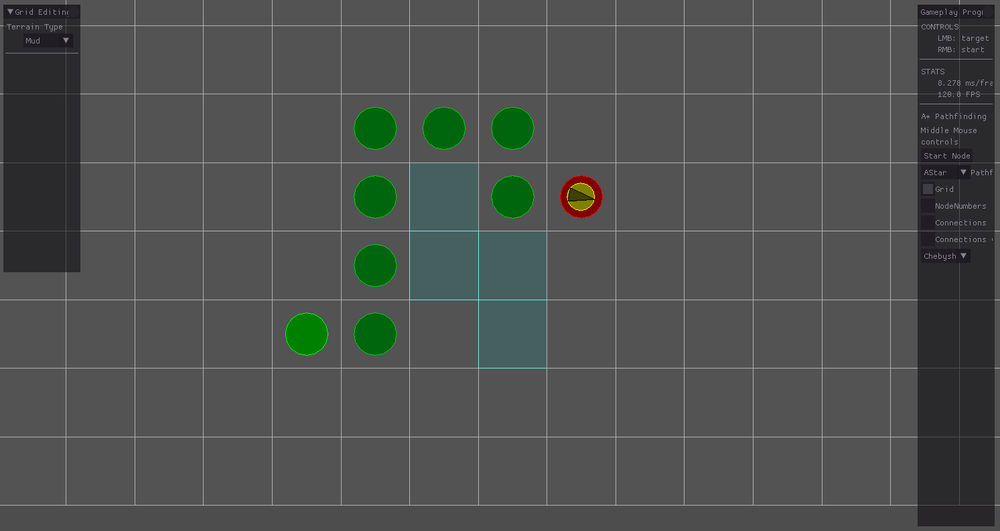

*There is a line of sight between two points if they are in the same row or in the same column :*
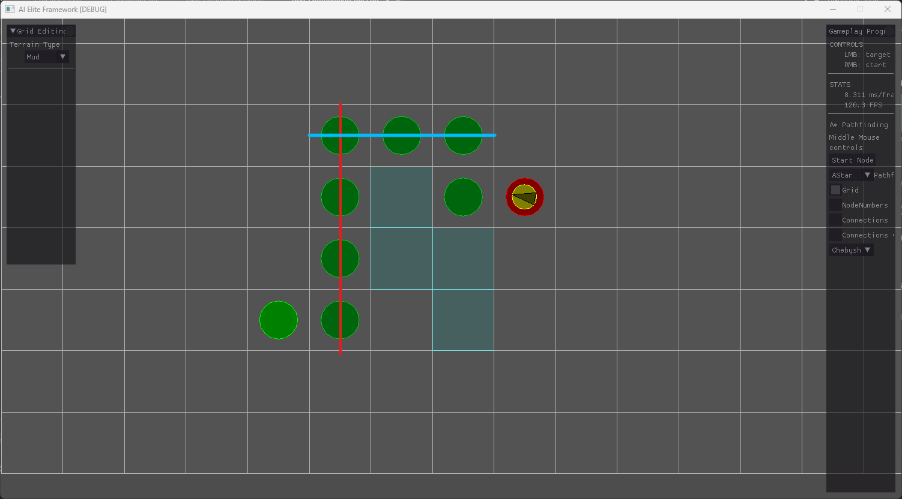

*Theta\* eliminate the inbetween nodes situated on this line of sight :*
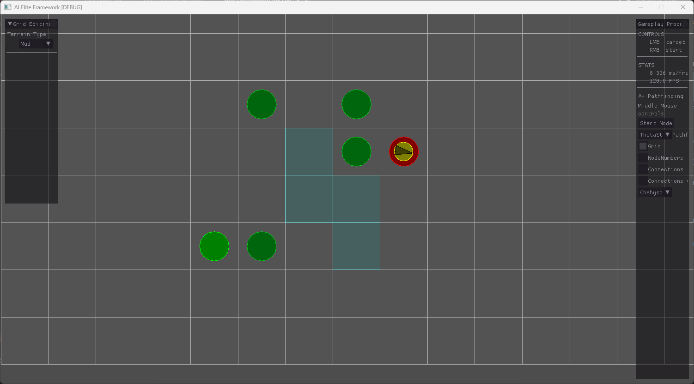

### Implementation :
Practically, the implementation of Theta* is relatively similar to the implementation of A*. We simply add a test condition when we add a node to the path. If we can trace a line of sight between the previous and the next node, the current node is not added to the path.

*If there is a Line of sight between a node and its grandparent, we can avoid the parent node*
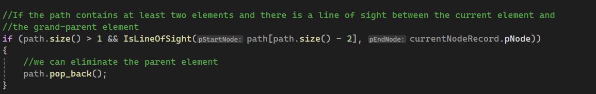

### Use Cases :
Due to the small amount of changes between A* and Theta*, their computation time is relatively equivalent.
However, the amount of nodes stored in a Theta* path is slightly lower than the amount of nodes in an equivalent A* path.
Due to this fact, using Theta* could be usefull when the memory is really an issue, an the device on which we calculate the pathfinding is not able to store an extensive path.

### A* with Post-Smoothing (A*PS) :
If we don’t want to modify the initial code of the A* pathfinding but we still want to have a result similar to the Theta* path, it is also possible to compute a new path from an existing A* path.
Knowing that, it’s totally possible to calculate A* path and then eliminate all the redundant or useless node from the path.
A* PS is slightly slower to compute than Theta* algorithm, because it will first calculate A* and then modify the result. But it has the following advantages :
- It could be easier to understand for someone who already knows A* pathfinding because the only step that is added to this algorithm is added after the main computation and does not modify the behavior of A*
- For the same reason, it is easier to implement if we already have access to an A* pathfinding algorithm because we only have to post-process an existing result without modifying a base algorithm.

### References :
2 : Wikipedia page : https://en.wikipedia.org/wiki/Theta*

3 : Kenny DANIEL, Alex NASH, Sven KOENIG - Theta*: Any-Angle Path Planning on Grids

## Jump Point Search :

### General Explanation :
JPS pathfinding algorithm is an optimization to A* pathfinding algorithm that reduces the time of computation only in uniform-cost grids.
In a non-uniform cost grid, JPS algorithm will not guarantee the shortest path since it does not take the costs into account.

A uniform cost grid is a grid where the connections have either no cost or all the same cost.

### Implementation :

#### Phases :
JPS algorithm is divided into two distinct phases : 
-	**Finding the Jumping points.** ( What a **jumping point** is will be explained later in this document.)
-	**Connecting theses jumping points.**

#### Jumping point :
To determine if a node is a Jumping point it must fulfill at least one of these 3 condtions :
1. The node is the starting node or the target node of the path.
2. The node has at least one forced neighbour (explained later).
3. If the direction between this node and its predecessor node is diagonal and there is an horizontal or vertical neighbour of this node that satisfies condition 1. or 2.

*How to determine if a node is a jumping point :*

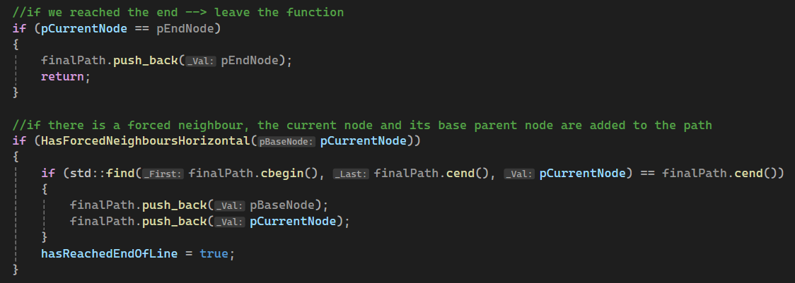

*The Path connects the different jumping points*

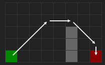

#### Forced Neighbour :
The last element of vocabulary that we have to define is what is a **Forced Neighbour**.
A forced neighbour can be determined if at least one of these two conditions is respected.

1. If the direction between a node and its predecessor is horizontal or vertical, and if this node has an obstacle in its direct neighborhood not in the direction of the movement, the point next to this obstacle in the same direction will be considered as a forced neighbour.

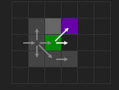

2. If the direction between the a node and its predecessor is diagonal, and if this node has an obstacle in its direct neighborhood, the point next to this obstacle in the same direction will be considered as a forced neighbour. The eventual points that are located horizontally and vertically next to this obstacle in the same direction will also be considered as forced neighbor.

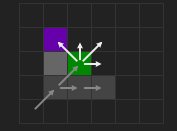

#### Step by step explanation of JPS Algorithm :
Now that we know all the necessary vocabulary to compute JPS it is time to explain how this algorithm works step by step.
1. We take the starting point and we add it to the jump point list, the computation of the pathfinding algorithm will start from this node.

2. We will check all the nodes in Horizontal and vertical direction of that node until we meet an obstacle, a jumping point, or if we are outside of the grid.

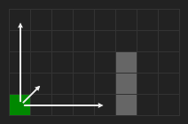

3. If no jumping point was encountered we repeat step 2 with the 1 to 4 diagonal neighbour(s) of the starting point.

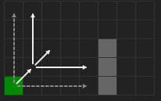

4. If a jumping point was found, we add it to the list and we repeat step 2 from that node.

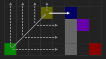

5. If the current jumping point is the end Point, we can stop the finding phase and start to connect the found jumping points in the shortest way possible. The best way to do that is to use a post-smoothing simmiliar to the one used for Theta*.

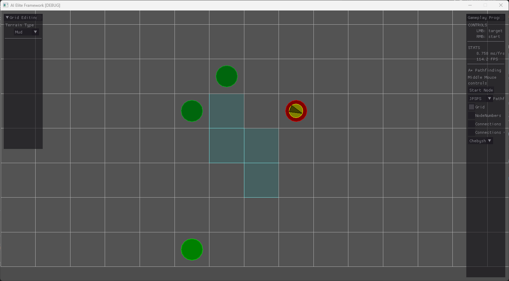

### References :
4 : Wikipedia Page : https://en.wikipedia.org/wiki/Jump_point_search

5 : A Visual Explanation of Jump Point Search : https://zerowidth.com/2013/a-visual-explanation-of-jump-point-search/

## Random Walks :

### Implementation :
The following Pathfinding algorithm will be probably the simplest to understand.

Here are the following steps of this algorithm :
1. **Add** the start node to the path, this starting node will be the first current node.
2. While the **current node is not the end node** :
	1. **Select** a random neighbour of the node.
	2. **Add** this random neighbour **to the path**.
	3. **Make** this random neighbour the **current node**.

*Here is my implementation of this algorithm :*

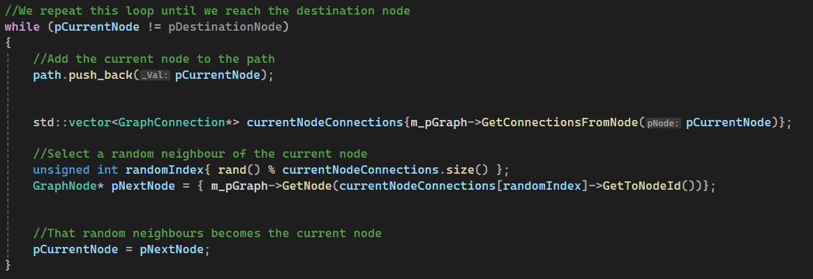

### Mathematical discussion about this algorithm :
Obviously, this algorithm does not guarantee to return the shortest path possible. In fact, we can be statistically sure that the path returned by this algorithm will be longer than the shortest path. So, this pathfinding algorithm is absolutely not ideal if we want to find the shortest path.

However, due to the fact that this algorithm asks for an extremely low computation power to be computed, it is still interesting to study this algorithm for the cases where the computation power is really an issue.
By studying this algorithm, we can try to answer these two questions :
-	What are the chances to get the shortest path possible ?
-	Which percentage of the surface bewteen two points will be statistically covered ?

Before I go deeper in the mathematical discussion of the random walks, I want to precise that the following calculations are made considering that every nodes in the graph have the same amount of connections. The purpose of this decision is to make the calculations clearer. It will give an estimation which is close to the reality, but the same probability in a given graph can slightly differ. I also made these calculations considering that we are in an unwheighted graph. In a weigthed one, the probabilities could highly differ depending of the costs of the connections, and the calculations should be graph specific.

#### Statistics about the shortest path :
The first question we can start to answer is the probability to get the shortest path possible. to estimate this number, we can start by calculating the chances to get a specific path.

According to the random walks rules, the main formula is the following : 

**1 / (number_of_neighbours ^ length_of_the_path)**.

That formula says that the number of possible paths increases exponentially depending of the length of the path.

But we can demonstrate it iteratively.
Let's suppose a graph where every node has 4 neighbours :

*For a length of 1, there are 4 path possible, the algorith has 25% of chances to get the shortest path*

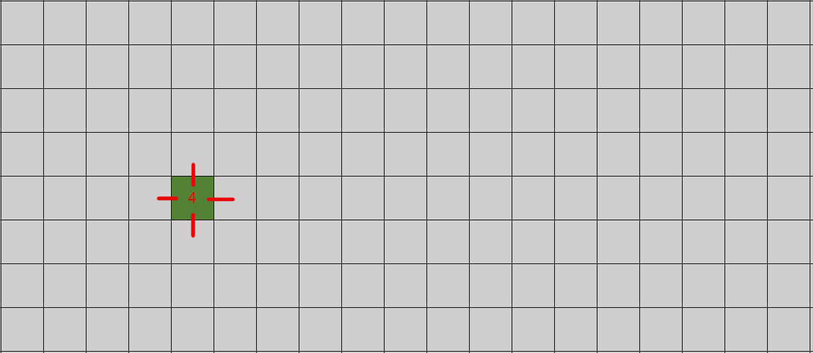

*For a length of 2, there are (4 ^ 2 = 16) path possible, the algorith has 6.25% of chances to get the shortest path*

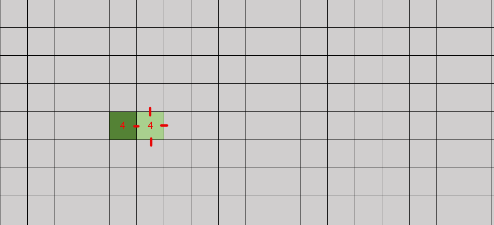

*For a length of 3, there are (4 ^ 3 = 64) path possible, the algorith has 1.5625% of chances to get the shortest path*

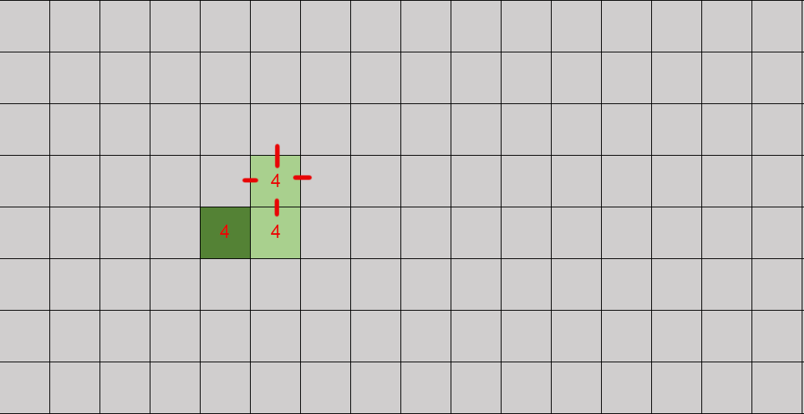

*Following the same logic, we have only 0.0006103515625% of chances to get a specific path with a length of 7*

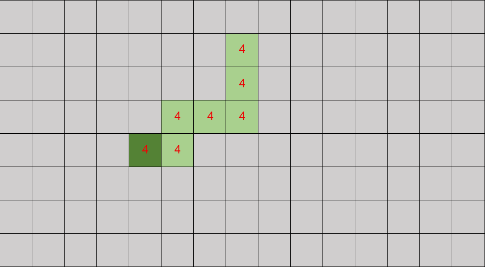

Now that we know the chances to get a specific path depending of its length, we can try to approximate the chances to get the shortest one.
A naive way to calculate this one would be to say that we have to use the previous formula replacing the lengthof the path by the length of the shortest path possible.

Unfortunately, this way to calculate won't be enough. Indeed, it exists certain situations where there are more than one shortest path.

*In this situation there is only one shortest path possible that leads to the end node.*

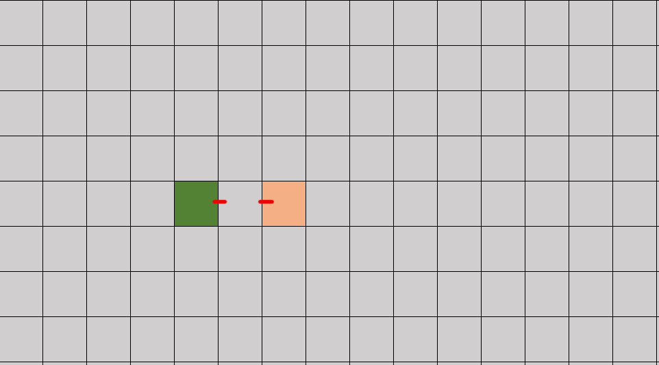

*In this other situation, there are two existing shortest path from a node to another.*

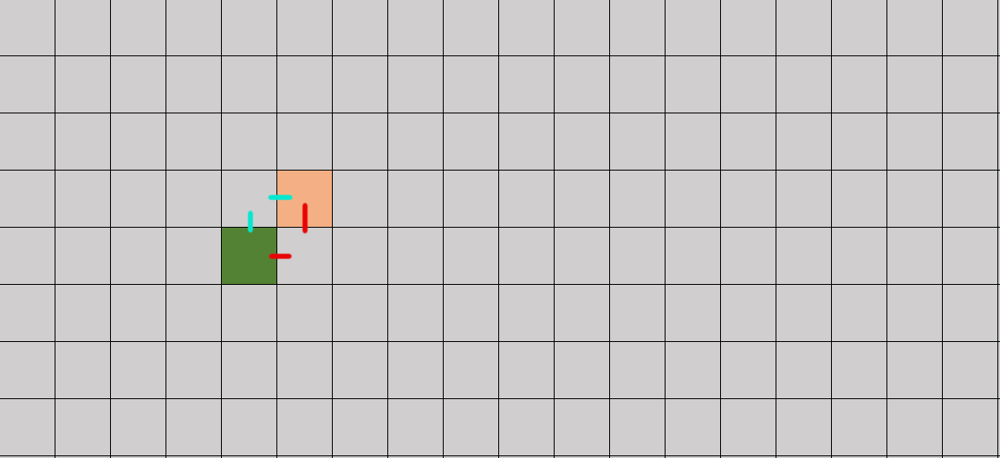

Intuitively, we can deduce that, if there are two shortest paths, whe have twice more chances to get at least one of them.

To get the probability formula of the shortest path we can deduce this formula : 

**nb_of_shortest_paths_possible / (number_of_neighbours ^ length_of_the_path)**.

*For example, in this situation, there are **2** paths possible with a length of **2**, so there are 12.5% of chances to get the shortest path.*

In term of all these calculations, we can deduce that this algorithm is far to be optimal for two main reasons :
- The chances to get the shortest path when we run this algorithm are way to low and reduces drastically when the length of the shortest path increases.
- The chances to get the shortest path can highly vary depending of the number of shortest paths possible.

#### Surface covered :
Compared to the previous point, this point will be way shorter to explain.
Following the properties of the random walk, we can say that, if we let the random walk algorithm indefinitely, all the nodes will be covered an infinite number of time.

Knowing that, the random walk algorithm is usefull when we want to be sure to cover the entierty of a graph.

### Applications
The random walks have many uses in term of pathfinding in many diffrent cases :
- If we simply want to know if there is a path between two nodes on a graph, we can launch a random walk pathfinding algorithm. If at any moment the agent reaches the target node, that means there is an existing path between the starting and the target node (see https://www.osti.gov/servlets/purl/1595912).
- If we want to cover the entierty of a map and we are limited in term of RAM and computation power or if we want to realize an unpredictable pattern.

### References
6 : Wikipedia page : https://en.wikipedia.org/wiki/Random_walk

7 : Sandia National Laboratories - Exploring Applications of Random Walks Using Neural Algorithms : https://www.osti.gov/servlets/purl/1595912

8 : Random Walk (Implementation in Python) : https://www.geeksforgeeks.org/random-walk-implementation-python/

## More about post smoothing :

In this project I used two post smoothing techniques to reduce the number of nodes stored in a path :
- If two nodes are on the same column or on the same row, we don't have to store the in between nodes in the path. This smoothing has the advantage to continue to work on a weighted graph. Indeed, the agent will continue to follow the connections directions, so the cost of the connections is still taken into account.
(image A* & PS)

- If there isn't any obstacle between two nodes, we don't have to store the in between nodes in the path. This smoothing will keep less nodes in memory than the previous one but, in counterpart, it is not guaranteed to give the shortest path in a weighted graph. Since the agent won't follow the connections directions anymore, it is not guaranteed to follow the shortest path.
(image A* & PS)

*Here is an example of how I implemented post smoothing to give a result similar to Theta\**

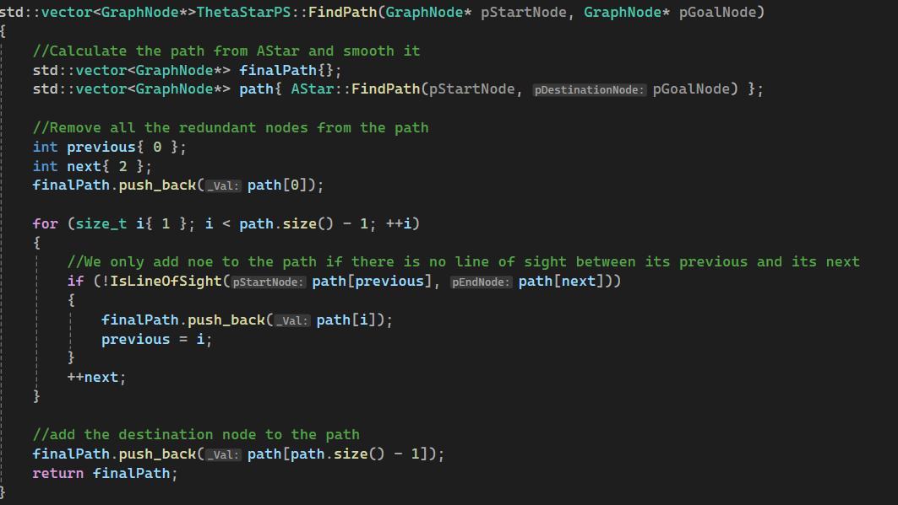

## Conclusion :

With all the research made for this reasearch topic, I implemented the following pathfinding :

- **A\* :**

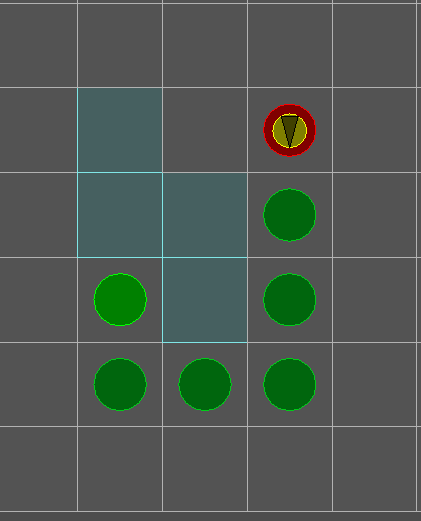

- **Theta\* :**

- **Post-Smoothing on A\* looking like Theta\* :**

- **Any-angle Post-Smoothing (a post-smoothing method that gives a result similar to Jump Point search) :**

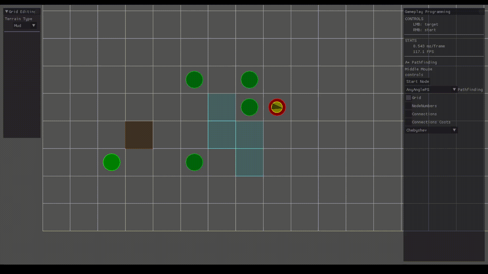

- **Jump Point Search :**

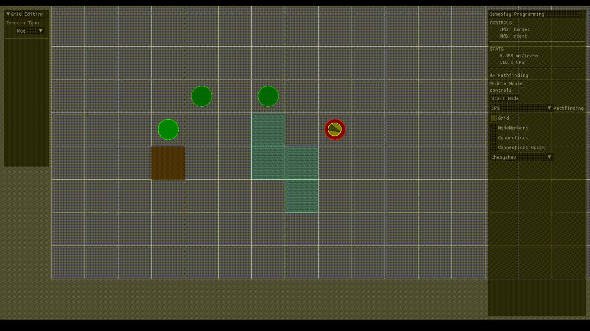

- **Jump Point Search with Post-Smoothing :**

- **Random Walk :**

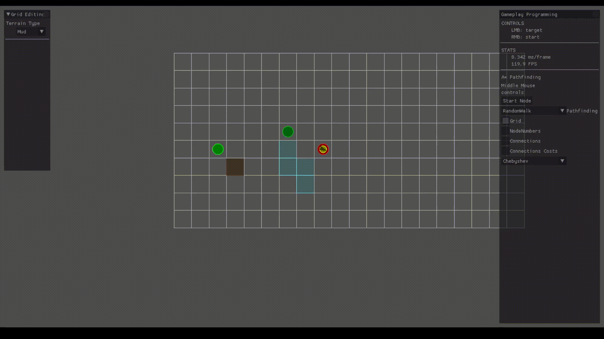

There are obviously many more existing pathfinding algorithms that could be interesting to implement, because of their own strength.
We can for example talk about :
- D* which can easily recalculate its path even if the obstacles are moving.
- Multi-agent pathfinding algorithms, to create a path for multiple agents at the same time.
- Incremental Phi* which is an optimization to Theta* that, similarly to D* lite, allow to modify the map during the time the path is traveled.